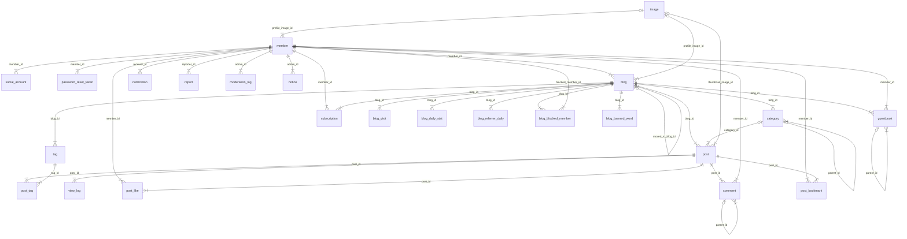
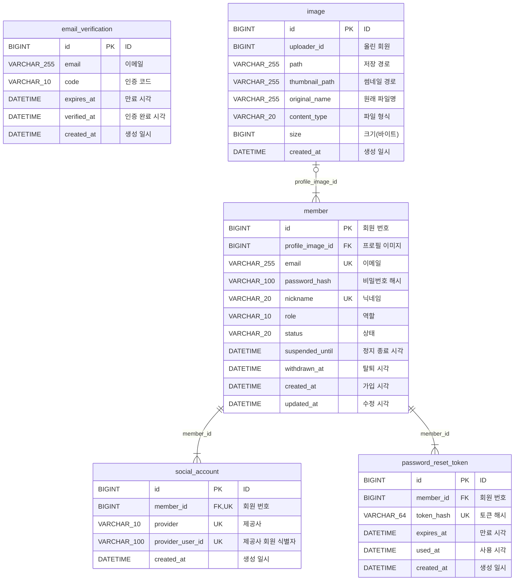
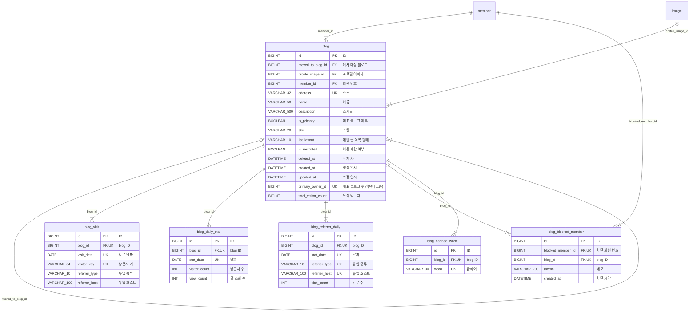
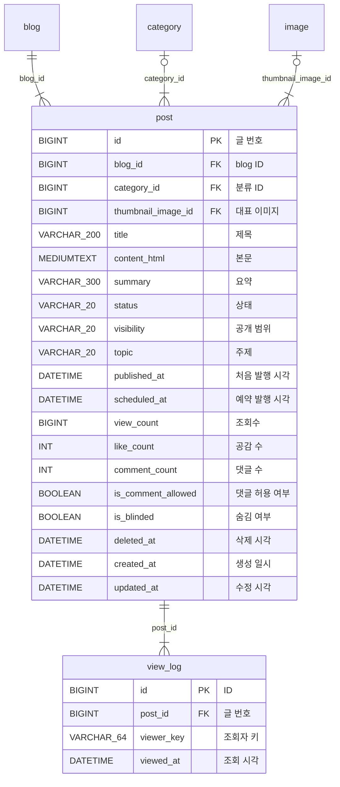
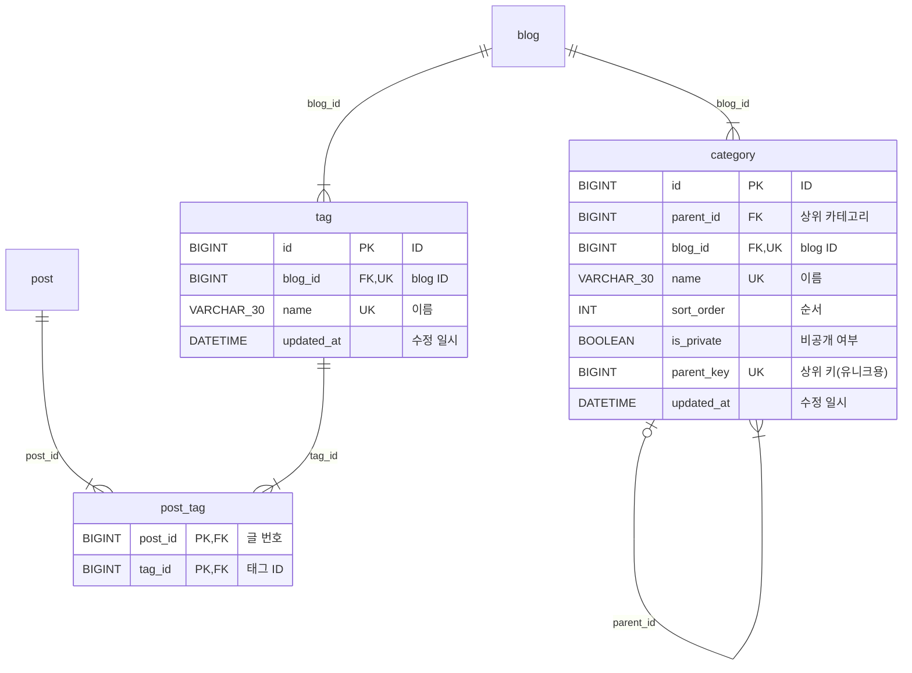
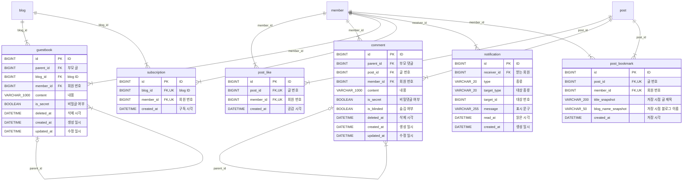
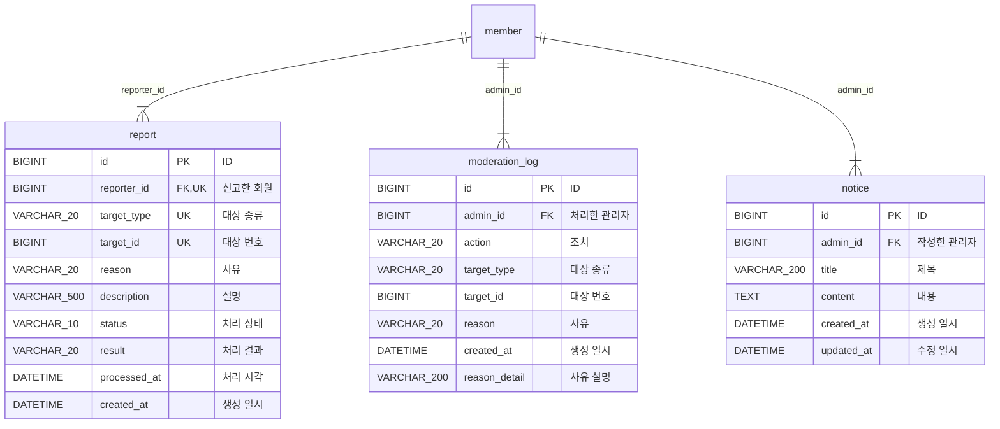

# ERD

> **이 문서는?** Crowfoot에서 설계한 지원 블로그 서비스의 ERD를 정리한 것이다. 원본은 Crowfoot 문서 [티스토리 클론 블로그 (지원)](https://crowfoot.java21.net/workspaces/49/models/665)이고, 이 파일은 그 내용을 옮긴 사본이다. 설계를 바꿀 때는 Crowfoot을 먼저 고치고 이 파일을 다시 만든다.

- 기준: Crowfoot 문서 버전 62 (2026-10-08), MySQL
- 테이블 25개, 관계 37개, 영역 6개
- 실행 가능한 DDL: [schema.sql](./schema.sql)
- [data-model.md](../data-model.md)와 달라진 점: [data-model-diff.md](./data-model-diff.md)
- 다이어그램 표기: `||` 정확히 하나, `|o` 없거나 하나, `|{` 하나 이상. 관계 이름은 자식 쪽 외래 키 컬럼이다. 키 표시는 PK(기본 키), FK(외래 키), UK(유니크 키에 포함)

## 목차

- [전체 관계도](#전체-관계도)
- [1. 회원·인증](#1-회원인증)
- [2. 블로그](#2-블로그)
- [3. 글](#3-글)
- [4. 카테고리·태그](#4-카테고리태그)
- [5. 소통](#5-소통)
- [6. 관리](#6-관리)
- [설계 규칙](#설계-규칙)

## 전체 관계도

컬럼을 빼고 테이블과 관계만 그렸다. 컬럼은 아래 영역별 그림에 있다. 관계가 없는 `email_verification`(가입 전 단계라 회원과 연결하지 않음)은 이 그림에서 빠진다.

## 1. 회원·인증

### member (회원)

이메일 가입·소셜 가입 회원. 탈퇴해도 행은 남는다

| 컬럼 | 논리명 | 타입 | NULL | 기본값 | 키 | 설명 |
| --- | --- | --- | --- | --- | --- | --- |
| `id` | 회원 번호 | BIGINT | N | 자동 증가 | PK |  |
| `profile_image_id` | 프로필 이미지 | BIGINT | Y |  | FK |  |
| `email` | 이메일 | VARCHAR(255) | Y |  | UK | 이메일 가입 회원만 값이 있고 모두 인증됨. 소셜 가입·탈퇴 회원은 NULL |
| `password_hash` | 비밀번호 해시 | VARCHAR(100) | Y |  |  | bcrypt |
| `nickname` | 닉네임 | VARCHAR(20) | N |  | UK |  |
| `role` | 역할 | VARCHAR(10) | N | USER |  | 가입은 항상 USER. ADMIN은 data.sql로만 |
| `status` | 상태 | VARCHAR(20) | N | ACTIVE |  | 모든 로그인 경로에서 먼저 확인 |
| `suspended_until` | 정지 종료 시각 | DATETIME | Y |  |  | SUSPENDED + NULL = 영구 정지. 사유는 moderation_log 최신 SUSPEND 행 |
| `withdrawn_at` | 탈퇴 시각 | DATETIME | Y |  |  |  |
| `created_at` | 가입 시각 | DATETIME(6) | N | CURRENT_TIMESTAMP(6) |  |  |
| `updated_at` | 수정 시각 | DATETIME(6) | N | CURRENT_TIMESTAMP(6) |  |  |

- 유니크 `uk_member_email`: (email)
- 유니크 `uk_member_nickname`: (nickname)
- CHECK `ck_member_role`: `role IN ('USER', 'ADMIN')`
- CHECK `ck_member_status`: `status IN ('ACTIVE', 'SUSPENDED', 'WITHDRAWN')`
- 근거 기능: AUTH-01, AUTH-05, AUTH-06, ADMIN-01, ADMIN-02, ADMIN-06, AUTH-02, AUTH-03, AUTH-04, HOME-04

### social_account (소셜 연동)

| 컬럼 | 논리명 | 타입 | NULL | 기본값 | 키 | 설명 |
| --- | --- | --- | --- | --- | --- | --- |
| `id` | ID | BIGINT | N | 자동 증가 | PK |  |
| `member_id` | 회원 번호 | BIGINT | N |  | FK,UK |  |
| `provider` | 제공사 | VARCHAR(10) | N |  | UK |  |
| `provider_user_id` | 제공사 회원 식별자 | VARCHAR(100) | N |  | UK |  |
| `created_at` | 생성 일시 | DATETIME(6) | N | CURRENT_TIMESTAMP(6) |  |  |

- 유니크 `uk_social_account_provider_provider_user_id`: (provider, provider_user_id)
- 유니크 `uk_social_account_member_id_provider`: (member_id, provider)
- CHECK `ck_social_account_provider`: `provider IN ('KAKAO', 'GOOGLE')`
- 근거 기능: OWN-03, AUTH-06

### email_verification (이메일 인증)

가입 전 단계라 회원과 연결하지 않는다

| 컬럼 | 논리명 | 타입 | NULL | 기본값 | 키 | 설명 |
| --- | --- | --- | --- | --- | --- | --- |
| `id` | ID | BIGINT | N | 자동 증가 | PK |  |
| `email` | 이메일 | VARCHAR(255) | N |  |  |  |
| `code` | 인증 코드 | VARCHAR(10) | N |  |  |  |
| `expires_at` | 만료 시각 | DATETIME | N |  |  |  |
| `verified_at` | 인증 완료 시각 | DATETIME | Y |  |  |  |
| `created_at` | 생성 일시 | DATETIME(6) | N | CURRENT_TIMESTAMP(6) |  |  |

- 인덱스 `idx_email_verification_email_created_at`: (email, created_at DESC)
- 근거 기능: AUTH-01, OWN-01

### password_reset_token (비밀번호 재설정 토큰)

| 컬럼 | 논리명 | 타입 | NULL | 기본값 | 키 | 설명 |
| --- | --- | --- | --- | --- | --- | --- |
| `id` | ID | BIGINT | N | 자동 증가 | PK |  |
| `member_id` | 회원 번호 | BIGINT | N |  | FK |  |
| `token_hash` | 토큰 해시 | VARCHAR(64) | N |  | UK | 링크 토큰의 SHA-256. 원문은 저장하지 않는다 |
| `expires_at` | 만료 시각 | DATETIME | N |  |  | 발급 후 30분 |
| `used_at` | 사용 시각 | DATETIME | Y |  |  | 한 번 쓰면 기록 |
| `created_at` | 생성 일시 | DATETIME(6) | N | CURRENT_TIMESTAMP(6) |  |  |

- 유니크 `uk_password_reset_token_token_hash`: (token_hash)
- 근거 기능: OWN-02

### image (이미지)

업로드 파일. ./uploads/{uuid}.{ext}

| 컬럼 | 논리명 | 타입 | NULL | 기본값 | 키 | 설명 |
| --- | --- | --- | --- | --- | --- | --- |
| `id` | ID | BIGINT | N | 자동 증가 | PK |  |
| `uploader_id` | 올린 회원 | BIGINT | N |  |  | member.id. 회원 ↔ 이미지 순환 참조를 피하려고 외래 키 없이 둔다. 서버가 로그인 회원으로 채운다 |
| `path` | 저장 경로 | VARCHAR(255) | N |  |  |  |
| `thumbnail_path` | 썸네일 경로 | VARCHAR(255) | Y |  |  |  |
| `original_name` | 원래 파일명 | VARCHAR(255) | N |  |  |  |
| `content_type` | 파일 형식 | VARCHAR(20) | N |  |  | image/jpeg, image/png, image/gif, image/webp |
| `size` | 크기(바이트) | BIGINT | N |  |  |  |
| `created_at` | 생성 일시 | DATETIME(6) | N | CURRENT_TIMESTAMP(6) |  |  |

- 인덱스 `idx_image_uploader_id`: (uploader_id)
- CHECK `ck_image_size`: `size <= 10485760`
- 근거 기능: AUTH-05, POST-05, BLOG-02, POST-07

## 2. 블로그

다른 영역 테이블(`image`, `member`)은 이름만 표시했다.

### blog (블로그)

주소는 삭제돼도 행이 남아 영구 예약

| 컬럼 | 논리명 | 타입 | NULL | 기본값 | 키 | 설명 |
| --- | --- | --- | --- | --- | --- | --- |
| `id` | ID | BIGINT | N | 자동 증가 | PK |  |
| `moved_to_blog_id` | 이사 대상 블로그 | BIGINT | Y |  | FK | 연쇄 이사 시 최종 대상으로 갱신 |
| `profile_image_id` | 프로필 이미지 | BIGINT | Y |  | FK |  |
| `member_id` | 회원 번호 | BIGINT | N |  | FK |  |
| `address` | 주소 | VARCHAR(32) | N |  | UK | 영문 소문자·숫자·하이픈 4~32자, 불변 |
| `name` | 이름 | VARCHAR(50) | N |  |  |  |
| `description` | 소개글 | VARCHAR(500) | Y |  |  |  |
| `is_primary` | 대표 블로그 여부 | BOOLEAN | N | 0 |  |  |
| `skin` | 스킨 | VARCHAR(20) | N | BASIC |  |  |
| `list_layout` | 메인 글 목록 형태 | VARCHAR(10) | N | LIST |  |  |
| `is_restricted` | 이용 제한 여부 | BOOLEAN | N | 0 |  | 사유는 moderation_log 최신 RESTRICT_BLOG 행 |
| `deleted_at` | 삭제 시각 | DATETIME | Y |  |  |  |
| `created_at` | 생성 일시 | DATETIME(6) | N | CURRENT_TIMESTAMP(6) |  |  |
| `updated_at` | 수정 일시 | DATETIME(6) | N | CURRENT_TIMESTAMP(6) |  |  |
| `primary_owner_id` | 대표 블로그 주인(유니크용) | BIGINT | Y | 계산: `CASE WHEN is_primary = 1 AND deleted_at IS NULL THEN member_id END` | UK | 회원당 대표 블로그 하나를 DB에서 보장하는 계산 컬럼 |
| `total_visitor_count` | 누적 방문자 | BIGINT | N | 0 |  | 매일 새벽 전날 방문자 수를 더한다. 오늘 방문자는 포함하지 않는다 |

- 유니크 `uk_blog_address`: (address)
- 유니크 `uk_blog_primary_owner_id`: (primary_owner_id)
- CHECK `ck_blog_list_layout`: `list_layout IN ('LIST', 'THUMBNAIL')`
- 근거 기능: AUTH-06, BLOG-01, BLOG-05, BLOG-06, BLOG-07, ADMIN-05, AUTH-04, BLOG-02, BLOG-03, BLOG-04, BLOG-08, SUB-06, SRCH-02, HOME-04, HOME-05, MNG-03

### blog_visit (블로그 방문)

블로그·날짜·방문자마다 한 행(하루 1회). 주인 본인 방문은 세지 않는다. 매일 새벽 blog_daily_stat·blog_referrer_daily로 모으고 7일 뒤 지운다

| 컬럼 | 논리명 | 타입 | NULL | 기본값 | 키 | 설명 |
| --- | --- | --- | --- | --- | --- | --- |
| `id` | ID | BIGINT | N | 자동 증가 | PK |  |
| `blog_id` | blog ID | BIGINT | N |  | FK,UK |  |
| `visit_date` | 방문 날짜 | DATE | N |  | UK |  |
| `visitor_key` | 방문자 키 | VARCHAR(64) | N |  | UK | 회원 id 또는 익명 식별자(view_log와 같은 방식) |
| `referrer_type` | 유입 종류 | VARCHAR(10) | N | DIRECT |  | SEARCH, SNS, DIRECT, INTERNAL, OTHER |
| `referrer_host` | 유입 호스트 | VARCHAR(100) | N | '' |  | Referer의 호스트. 직접 방문이면 빈 값 |

- 유니크 `uk_blog_visit_blog_id_visit_date_visitor_key`: (blog_id, visit_date, visitor_key)
- 인덱스 `idx_blog_visit_visit_date`: (visit_date)
- CHECK `ck_blog_visit_referrer_type`: `referrer_type IN ('SEARCH','SNS','DIRECT','INTERNAL','OTHER')`
- 근거 기능: MNG-03

### blog_daily_stat (블로그 일별 통계)

전날 blog_visit을 모은 일별 방문자 수와 글 조회 수. 어제 방문자와 일·주·월 그래프에 쓴다

| 컬럼 | 논리명 | 타입 | NULL | 기본값 | 키 | 설명 |
| --- | --- | --- | --- | --- | --- | --- |
| `id` | ID | BIGINT | N | 자동 증가 | PK |  |
| `blog_id` | blog ID | BIGINT | N |  | FK,UK |  |
| `stat_date` | 날짜 | DATE | N |  | UK |  |
| `visitor_count` | 방문자 수 | INT | N | 0 |  |  |
| `view_count` | 글 조회 수 | INT | N | 0 |  |  |

- 유니크 `uk_blog_daily_stat_blog_id_stat_date`: (blog_id, stat_date)
- 근거 기능: MNG-03

### blog_referrer_daily (블로그 일별 유입 경로)

전날 blog_visit을 유입 종류·호스트별로 센 값

| 컬럼 | 논리명 | 타입 | NULL | 기본값 | 키 | 설명 |
| --- | --- | --- | --- | --- | --- | --- |
| `id` | ID | BIGINT | N | 자동 증가 | PK |  |
| `blog_id` | blog ID | BIGINT | N |  | FK,UK |  |
| `stat_date` | 날짜 | DATE | N |  | UK |  |
| `referrer_type` | 유입 종류 | VARCHAR(10) | N |  | UK |  |
| `referrer_host` | 유입 호스트 | VARCHAR(100) | N | '' | UK |  |
| `visit_count` | 방문 수 | INT | N | 0 |  |  |

- 유니크 `uk_blog_referrer_daily_blog_id_stat_date_referrer_type_referrer_host`: (blog_id, stat_date, referrer_type, referrer_host)
- 근거 기능: MNG-03

### blog_blocked_member (차단 회원)

블로그 주인이 차단한 회원. 그 블로그에 댓글·방명록을 쓰거나 구독할 수 없다. 주인이 쓰는 기능이라 관리 이력에 남기지 않는다

| 컬럼 | 논리명 | 타입 | NULL | 기본값 | 키 | 설명 |
| --- | --- | --- | --- | --- | --- | --- |
| `id` | ID | BIGINT | N | 자동 증가 | PK |  |
| `blocked_member_id` | 차단 회원 번호 | BIGINT | N |  | FK,UK |  |
| `blog_id` | blog ID | BIGINT | N |  | FK,UK |  |
| `memo` | 메모 | VARCHAR(200) | Y |  |  |  |
| `created_at` | 차단 시각 | DATETIME(6) | N | CURRENT_TIMESTAMP(6) |  |  |

- 유니크 `uk_blog_block_blog_id_blocked_member_id`: (blog_id, blocked_member_id)
- 근거 기능: MNG-04

### blog_banned_word (금칙어)

블로그별 금칙어. 최대 100개, 대소문자 무시 포함 검사

| 컬럼 | 논리명 | 타입 | NULL | 기본값 | 키 | 설명 |
| --- | --- | --- | --- | --- | --- | --- |
| `id` | ID | BIGINT | N | 자동 증가 | PK |  |
| `blog_id` | blog ID | BIGINT | N |  | FK,UK |  |
| `word` | 금칙어 | VARCHAR(30) | N |  | UK |  |

- 유니크 `uk_blog_banned_word_blog_id_word`: (blog_id, word)
- 근거 기능: MNG-04

## 3. 글

다른 영역 테이블(`blog`, `category`, `image`)은 이름만 표시했다.

### post (글)

글 주소 {주소}.blog.com/{id}. 이사하면 blog_id가 바뀌고 옛 주소는 301

| 컬럼 | 논리명 | 타입 | NULL | 기본값 | 키 | 설명 |
| --- | --- | --- | --- | --- | --- | --- |
| `id` | 글 번호 | BIGINT | N | 자동 증가 | PK |  |
| `blog_id` | blog ID | BIGINT | N |  | FK |  |
| `category_id` | 분류 ID | BIGINT | Y |  | FK |  |
| `thumbnail_image_id` | 대표 이미지 | BIGINT | Y |  | FK |  |
| `title` | 제목 | VARCHAR(200) | N |  |  |  |
| `content_html` | 본문 | MEDIUMTEXT | N |  |  | 서버 정화 후 저장 |
| `summary` | 요약 | VARCHAR(300) | Y |  |  | jsoup으로 태그 제거 |
| `status` | 상태 | VARCHAR(20) | N | DRAFT |  |  |
| `visibility` | 공개 범위 | VARCHAR(20) | N | PUBLIC |  |  |
| `topic` | 주제 | VARCHAR(20) | Y |  |  | NULL = 주제 없음 |
| `published_at` | 처음 발행 시각 | DATETIME(6) | Y |  |  | 정렬 기준, 수정해도 불변 |
| `scheduled_at` | 예약 발행 시각 | DATETIME | Y |  |  |  |
| `view_count` | 조회수 | BIGINT | N | 0 |  |  |
| `like_count` | 공감 수 | INT | N | 0 |  | 비정규화, 같은 트랜잭션에서 갱신 |
| `comment_count` | 댓글 수 | INT | N | 0 |  | 비정규화, 같은 트랜잭션에서 갱신 |
| `is_comment_allowed` | 댓글 허용 여부 | BOOLEAN | N | 1 |  |  |
| `is_blinded` | 숨김 여부 | BOOLEAN | N | 0 |  | 사유는 moderation_log 최신 BLIND 행 |
| `deleted_at` | 삭제 시각 | DATETIME | Y |  |  |  |
| `created_at` | 생성 일시 | DATETIME(6) | N | CURRENT_TIMESTAMP(6) |  |  |
| `updated_at` | 수정 시각 | DATETIME(6) | N | CURRENT_TIMESTAMP(6) |  |  |

- 인덱스 `idx_post_blog_feed`: (blog_id, status, visibility, published_at DESC, id DESC)
- 인덱스 `idx_post_home_feed`: (status, visibility, published_at DESC, id DESC)
- 인덱스 `idx_post_topic_feed`: (topic, status, visibility, published_at DESC)
- 인덱스 `idx_post_scheduled`: (status, scheduled_at)
- CHECK `ck_post_status`: `status IN ('DRAFT', 'PUBLISHED', 'SCHEDULED')`
- CHECK `ck_post_visibility`: `visibility IN ('PUBLIC', 'PRIVATE', 'SUBSCRIBERS')`
- CHECK `ck_post_topic`: `topic IS NULL OR topic IN ('IT_DEV', 'TRAVEL', 'FOOD', 'DAILY', 'REVIEW', 'HOBBY', 'FINANCE', 'HEALTH', 'CULTURE', 'EDUCATION')`
- 근거 기능: AUTH-06, BLOG-06, BLOG-07, POST-01, POST-06, POST-08, POST-09, POST-11, HOME-02, CAT-01, CMT-01, SOC-01, ADMIN-03, ADMIN-06, BLOG-03, BLOG-04, POST-02, POST-03, POST-04, POST-07, POST-10, POST-12, POST-13, CAT-02, TAG-02, CMT-07, SOC-02, SOC-03, SUB-02, SRCH-01, SRCH-02, HOME-01, HOME-03, HOME-04, HOME-05, MNG-01, OWN-05

### view_log (조회 기록)

같은 viewer_key가 5분 안에 다시 열면 기록하지 않는다. 최근 1시간 인기 점수와 최근 7일 블로그 점수 집계. 7일보다 오래된 행은 매일 지운다

| 컬럼 | 논리명 | 타입 | NULL | 기본값 | 키 | 설명 |
| --- | --- | --- | --- | --- | --- | --- |
| `id` | ID | BIGINT | N | 자동 증가 | PK |  |
| `post_id` | 글 번호 | BIGINT | N |  | FK |  |
| `viewer_key` | 조회자 키 | VARCHAR(64) | N |  |  | 회원 id 또는 익명 식별자 |
| `viewed_at` | 조회 시각 | DATETIME(6) | N | CURRENT_TIMESTAMP(6) |  |  |

- 인덱스 `idx_view_log_viewed_at`: (viewed_at)
- 인덱스 `idx_view_log_post_id_viewer_key_viewed_at`: (post_id, viewer_key, viewed_at)
- 근거 기능: POST-09, HOME-02, HOME-03, HOME-04

## 4. 카테고리·태그

다른 영역 테이블(`blog`, `post`)은 이름만 표시했다.

### category (카테고리)

'전체 글'·'미분류'는 행이 아니라 가상 항목

| 컬럼 | 논리명 | 타입 | NULL | 기본값 | 키 | 설명 |
| --- | --- | --- | --- | --- | --- | --- |
| `id` | ID | BIGINT | N | 자동 증가 | PK |  |
| `parent_id` | 상위 카테고리 | BIGINT | Y |  | FK | NULL 또는 1단계 상위 |
| `blog_id` | blog ID | BIGINT | N |  | FK,UK |  |
| `name` | 이름 | VARCHAR(30) | N |  | UK |  |
| `sort_order` | 순서 | INT | N | 0 |  |  |
| `is_private` | 비공개 여부 | BOOLEAN | N | 0 |  |  |
| `parent_key` | 상위 키(유니크용) | BIGINT | N | 계산: `IFNULL(parent_id, 0)` | UK | MySQL UNIQUE는 NULL끼리 중복을 허용하므로 최상위 이름 중복을 막기 위한 계산 컬럼 |
| `updated_at` | 수정 일시 | DATETIME(6) | N | CURRENT_TIMESTAMP(6) |  |  |

- 유니크 `uk_category_blog_id_parent_key_name`: (blog_id, parent_key, name)
- 근거 기능: BLOG-06, POST-01, CAT-01, BLOG-03, BLOG-04, POST-04, CAT-02, CAT-03, CAT-04, CAT-05, MNG-01, OWN-05

### tag (태그)

| 컬럼 | 논리명 | 타입 | NULL | 기본값 | 키 | 설명 |
| --- | --- | --- | --- | --- | --- | --- |
| `id` | ID | BIGINT | N | 자동 증가 | PK |  |
| `blog_id` | blog ID | BIGINT | N |  | FK,UK |  |
| `name` | 이름 | VARCHAR(30) | N |  | UK |  |
| `updated_at` | 수정 일시 | DATETIME(6) | N | CURRENT_TIMESTAMP(6) |  |  |

- 유니크 `uk_tag_blog_id_name`: (blog_id, name)
- 근거 기능: BLOG-06, POST-01, TAG-01, BLOG-03, BLOG-04, POST-04, TAG-02, TAG-03, TAG-04, SRCH-01

### post_tag (글 태그)

글당 최대 10개는 서비스에서 검사

| 컬럼 | 논리명 | 타입 | NULL | 기본값 | 키 | 설명 |
| --- | --- | --- | --- | --- | --- | --- |
| `post_id` | 글 번호 | BIGINT | N |  | PK,FK |  |
| `tag_id` | 태그 ID | BIGINT | N |  | PK,FK |  |

- 근거 기능: BLOG-06, POST-01, TAG-01, POST-02, POST-04, TAG-02, TAG-03, TAG-04, SRCH-01

## 5. 소통

다른 영역 테이블(`blog`, `member`, `post`)은 이름만 표시했다.

### comment (댓글)

| 컬럼 | 논리명 | 타입 | NULL | 기본값 | 키 | 설명 |
| --- | --- | --- | --- | --- | --- | --- |
| `id` | ID | BIGINT | N | 자동 증가 | PK |  |
| `parent_id` | 부모 댓글 | BIGINT | Y |  | FK | NULL 또는 1단계 |
| `post_id` | 글 번호 | BIGINT | N |  | FK |  |
| `member_id` | 회원 번호 | BIGINT | N |  | FK |  |
| `content` | 내용 | VARCHAR(1000) | N |  |  |  |
| `is_secret` | 비밀댓글 여부 | BOOLEAN | N | 0 |  |  |
| `is_blinded` | 숨김 여부 | BOOLEAN | N | 0 |  | 사유는 moderation_log 최신 BLIND 행 |
| `deleted_at` | 삭제 시각 | DATETIME | Y |  |  | 답글이 있으면 '삭제된 댓글입니다'로 표시 |
| `created_at` | 생성 일시 | DATETIME(6) | N | CURRENT_TIMESTAMP(6) |  |  |
| `updated_at` | 수정 일시 | DATETIME(6) | N | CURRENT_TIMESTAMP(6) |  |  |

- 인덱스 `idx_comment_created_at`: (created_at)
- 인덱스 `idx_comment_post_id_created_at`: (post_id, created_at)
- 근거 기능: AUTH-06, HOME-02, CMT-01, ADMIN-03, BLOG-04, POST-03, POST-04, CMT-02, CMT-03, CMT-05, CMT-06, HOME-03, HOME-04, MNG-02

### guestbook (방명록)

규칙은 댓글과 같다

| 컬럼 | 논리명 | 타입 | NULL | 기본값 | 키 | 설명 |
| --- | --- | --- | --- | --- | --- | --- |
| `id` | ID | BIGINT | N | 자동 증가 | PK |  |
| `parent_id` | 부모 글 | BIGINT | Y |  | FK |  |
| `blog_id` | blog ID | BIGINT | N |  | FK |  |
| `member_id` | 회원 번호 | BIGINT | N |  | FK |  |
| `content` | 내용 | VARCHAR(1000) | N |  |  |  |
| `is_secret` | 비밀글 여부 | BOOLEAN | N | 0 |  |  |
| `deleted_at` | 삭제 시각 | DATETIME | Y |  |  |  |
| `created_at` | 생성 일시 | DATETIME(6) | N | CURRENT_TIMESTAMP(6) |  |  |
| `updated_at` | 수정 일시 | DATETIME(6) | N | CURRENT_TIMESTAMP(6) |  |  |

- 인덱스 `idx_guestbook_blog_id_created_at`: (blog_id, created_at)
- 근거 기능: AUTH-06, CMT-04, MNG-02

### post_like (공감)

| 컬럼 | 논리명 | 타입 | NULL | 기본값 | 키 | 설명 |
| --- | --- | --- | --- | --- | --- | --- |
| `id` | ID | BIGINT | N | 자동 증가 | PK |  |
| `post_id` | 글 번호 | BIGINT | N |  | FK,UK |  |
| `member_id` | 회원 번호 | BIGINT | N |  | FK,UK |  |
| `created_at` | 공감 시각 | DATETIME(6) | N | CURRENT_TIMESTAMP(6) |  |  |

- 유니크 `uk_post_like_member_id_post_id`: (member_id, post_id)
- 인덱스 `idx_post_like_created_at`: (created_at)
- 근거 기능: AUTH-06, HOME-02, SOC-01, POST-03, HOME-03, HOME-04

### subscription (구독)

| 컬럼 | 논리명 | 타입 | NULL | 기본값 | 키 | 설명 |
| --- | --- | --- | --- | --- | --- | --- |
| `id` | ID | BIGINT | N | 자동 증가 | PK |  |
| `blog_id` | blog ID | BIGINT | N |  | FK,UK |  |
| `member_id` | 회원 번호 | BIGINT | N |  | FK,UK |  |
| `created_at` | 구독 시각 | DATETIME(6) | N | CURRENT_TIMESTAMP(6) |  |  |

- 유니크 `uk_subscription_member_id_blog_id`: (member_id, blog_id)
- 근거 기능: AUTH-06, SUB-01, POST-04, POST-12, SUB-02, SUB-03, SUB-06, HOME-04, MNG-04

### notification (알림)

| 컬럼 | 논리명 | 타입 | NULL | 기본값 | 키 | 설명 |
| --- | --- | --- | --- | --- | --- | --- |
| `id` | ID | BIGINT | N | 자동 증가 | PK |  |
| `receiver_id` | 받는 회원 | BIGINT | N |  | FK |  |
| `type` | 종류 | VARCHAR(20) | N |  |  |  |
| `target_type` | 대상 종류 | VARCHAR(20) | N |  |  |  |
| `target_id` | 대상 번호 | BIGINT | N |  |  |  |
| `message` | 표시 문구 | VARCHAR(255) | N |  |  |  |
| `read_at` | 읽은 시각 | DATETIME | Y |  |  |  |
| `created_at` | 생성 일시 | DATETIME(6) | N | CURRENT_TIMESTAMP(6) |  |  |

- 인덱스 `idx_notification_receiver_id_read_at`: (receiver_id, read_at)
- 인덱스 `idx_notification_target_type_target_id`: (target_type, target_id)
- CHECK `ck_notification_type`: `type IN ('COMMENT', 'REPLY', 'LIKE', 'SUBSCRIBE', 'SANCTION')`
- CHECK `ck_notification_target_type`: `target_type IN ('POST', 'COMMENT', 'BLOG', 'MEMBER')`
- 근거 기능: SUB-04, POST-03

### post_bookmark (저장)

회원이 저장한 글. 볼 수 없게 된 글도 행을 남기고 저장 시점 제목·블로그 이름만 보여 준다(헌법 원칙 II 예외)

| 컬럼 | 논리명 | 타입 | NULL | 기본값 | 키 | 설명 |
| --- | --- | --- | --- | --- | --- | --- |
| `id` | ID | BIGINT | N | 자동 증가 | PK |  |
| `post_id` | 글 번호 | BIGINT | N |  | FK,UK |  |
| `member_id` | 회원 번호 | BIGINT | N |  | FK,UK |  |
| `title_snapshot` | 저장 시점 글 제목 | VARCHAR(200) | N |  |  |  |
| `blog_name_snapshot` | 저장 시점 블로그 이름 | VARCHAR(50) | N |  |  |  |
| `created_at` | 저장 시각 | DATETIME(6) | N | CURRENT_TIMESTAMP(6) |  |  |

- 유니크 `uk_post_bookmark_member_id_post_id`: (member_id, post_id)
- 인덱스 `idx_post_bookmark_member_id_created_at_id`: (member_id, created_at DESC, id DESC)
- 근거 기능: SOC-03

## 6. 관리

다른 영역 테이블(`member`)은 이름만 표시했다.

### report (신고)

| 컬럼 | 논리명 | 타입 | NULL | 기본값 | 키 | 설명 |
| --- | --- | --- | --- | --- | --- | --- |
| `id` | ID | BIGINT | N | 자동 증가 | PK |  |
| `reporter_id` | 신고한 회원 | BIGINT | N |  | FK,UK |  |
| `target_type` | 대상 종류 | VARCHAR(20) | N |  | UK |  |
| `target_id` | 대상 번호 | BIGINT | N |  | UK |  |
| `reason` | 사유 | VARCHAR(20) | N |  |  |  |
| `description` | 설명 | VARCHAR(500) | Y |  |  | 사유가 ETC면 필수 |
| `status` | 처리 상태 | VARCHAR(10) | N | PENDING |  |  |
| `result` | 처리 결과 | VARCHAR(20) | Y |  |  |  |
| `processed_at` | 처리 시각 | DATETIME | Y |  |  |  |
| `created_at` | 생성 일시 | DATETIME(6) | N | CURRENT_TIMESTAMP(6) |  |  |

- 유니크 `uk_report_reporter_id_target_type_target_id`: (reporter_id, target_type, target_id)
- 인덱스 `idx_report_status_target_type_target_id`: (status, target_type, target_id)
- CHECK `ck_report_target_type`: `target_type IN ('POST', 'COMMENT', 'BLOG')`
- CHECK `ck_report_reason`: `reason IN ('SPAM', 'ADULT', 'ABUSE', 'COPYRIGHT', 'ETC')`
- CHECK `ck_report_etc_description`: `reason <> 'ETC' OR description IS NOT NULL`
- CHECK `ck_report_status`: `status IN ('PENDING', 'DONE')`
- CHECK `ck_report_result`: `result IS NULL OR result IN ('BLIND', 'RESTRICT_BLOG', 'SUSPEND', 'REJECT')`
- 근거 기능: ADMIN-04, ADMIN-06

### moderation_log (관리 이력)

INSERT만, 수정·삭제 API 없음. 제재 사유의 유일한 저장 위치: 대상의 최신 제재 행에서 사유를 읽는다

| 컬럼 | 논리명 | 타입 | NULL | 기본값 | 키 | 설명 |
| --- | --- | --- | --- | --- | --- | --- |
| `id` | ID | BIGINT | N | 자동 증가 | PK |  |
| `admin_id` | 처리한 관리자 | BIGINT | N |  | FK |  |
| `action` | 조치 | VARCHAR(20) | N |  |  |  |
| `target_type` | 대상 종류 | VARCHAR(20) | N |  |  |  |
| `target_id` | 대상 번호 | BIGINT | N |  |  |  |
| `reason` | 사유 | VARCHAR(20) | Y |  |  | 제재(BLIND, SUSPEND, RESTRICT_BLOG)에는 필수. 안내 문구는 Java enum 필드에 둔다 |
| `created_at` | 생성 일시 | DATETIME(6) | N | CURRENT_TIMESTAMP(6) |  |  |
| `reason_detail` | 사유 설명 | VARCHAR(200) | Y |  |  | 사유가 ETC면 필수 |

- 인덱스 `idx_moderation_log_target_type_target_id`: (target_type, target_id, created_at DESC)
- 인덱스 `idx_moderation_log_created_at`: (created_at)
- CHECK `ck_moderation_log_action`: `action IN ('BLIND', 'UNBLIND', 'SUSPEND', 'UNSUSPEND', 'RESTRICT_BLOG', 'UNRESTRICT_BLOG', 'REJECT_REPORT')`
- CHECK `ck_moderation_log_target_type`: `target_type IN ('POST', 'COMMENT', 'BLOG', 'MEMBER', 'REPORT')`
- CHECK `ck_moderation_log_reason`: `reason IS NULL OR reason IN ('SPAM', 'ADULT', 'ABUSE', 'COPYRIGHT', 'ETC')`
- CHECK `ck_moderation_log_sanction_reason`: `action NOT IN ('BLIND', 'SUSPEND', 'RESTRICT_BLOG') OR reason IS NOT NULL`
- CHECK `ck_moderation_log_etc_detail`: `reason IS NULL OR reason <> 'ETC' OR reason_detail IS NOT NULL`
- 근거 기능: ADMIN-05, ADMIN-02, ADMIN-03, ADMIN-04, ADMIN-06

### notice (공지)

| 컬럼 | 논리명 | 타입 | NULL | 기본값 | 키 | 설명 |
| --- | --- | --- | --- | --- | --- | --- |
| `id` | ID | BIGINT | N | 자동 증가 | PK |  |
| `admin_id` | 작성한 관리자 | BIGINT | N |  | FK |  |
| `title` | 제목 | VARCHAR(200) | N |  |  |  |
| `content` | 내용 | TEXT | N |  |  |  |
| `created_at` | 생성 일시 | DATETIME(6) | N | CURRENT_TIMESTAMP(6) |  |  |
| `updated_at` | 수정 일시 | DATETIME(6) | N | CURRENT_TIMESTAMP(6) |  |  |

- 인덱스 `idx_notice_created_at`: (created_at DESC)
- 근거 기능: ADMIN-06

## 설계 규칙

문서 전체에 적용되는 공통 요구사항(Crowfoot의 문서 범위 요구사항)이다.

### 공통 컬럼

- 모든 테이블은 id(BIGINT, 자동 증가) 기본 키를 둔다. 단, 연결 테이블 post_tag는 (post_id, tag_id) 복합 키
- created_at은 정렬·기간 집계·화면 표시에 쓰는 테이블에만 둔다(tag, post_tag, category, blog_visit, blog_banned_word는 없음). 고칠 수 있는 테이블에는 updated_at을 둔다
- 열거값은 VARCHAR + CHECK로 둔다(JPA EnumType.STRING). 안내 문구는 DB가 아니라 Java enum 필드에 둔다
- 참/거짓 컨럼은 is_ 접두사를 붙인다(is_primary, is_restricted, is_blinded 등). Java 필드는 접두사 없이(restricted) 두고 @Column(name = "is_restricted")로 잇는다

### 소프트 삭제 (Q1·Q3)

- 블로그·글·댓글·방명록은 deleted_at을 기록해 지운다. 활성 = deleted_at IS NULL
- 공감·구독·알림·태그 연결은 행을 지운다
- 물리 삭제가 없으므로 외래 키는 연쇄 삭제를 쓰지 않는다(연결 테이블 post_tag 제외)

### COM-01 글 가시성 판단

- 모든 목록·개수·검색·상세에 같은 조건을 쓴다: 삭제 안 됨, 발행됨, 숨김 아님, 블로그 제한·삭제 아님, 주인 정지 아님, 공개 또는 구독자 공개+구독 중
- 블로그 주인이 자기 블로그를 볼 때만 이 조건을 건너뛴다

### COM-02 오류 처리

- 우선순위: P0
- 404·403 화면, 입력 오류는 어느 항목이 잘못됐는지 안내하고 입력을 유지한다.
- 예상하지 못한 오류에도 내부 정보를 드러내지 않는다.

제외한 테이블: `post_embedding`(OWN-06 비슷한 글 추천, PostgreSQL + pgvector)은 도전 과제라 이 ERD에 넣지 않았다. Idempotency-Key와 인기 글·인기 블로거 순위 스냅숏은 Redis에 두므로 테이블이 없다.
